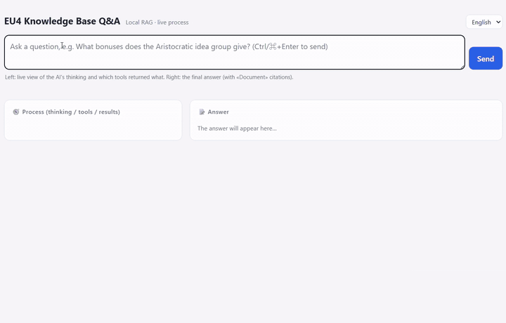

# eu4-kb — retrieval over a wiki and a game engine's script files

[](https://github.com/torisu233/eu4-kb/actions/workflows/ci.yml)
[](LICENSE)

<p align="center"><br><sub>A live run, real speed: the left panel streams the agent's reasoning, tool calls and raw tool results; the right panel is the cited answer. <a href="https://torisu233.github.io/eu4-kb/">More recorded runs ▶</a></sub></p>

**[▶ Replay demo](https://torisu233.github.io/eu4-kb/)** · **[Architecture](#architecture)** · **[Governance](#governance-and-blast-radius)** · **[Production notes](#production-notes)** · **[Data & licensing](#data-sources-and-licensing)**

A question-answering agent over two very different sources that describe the same domain: a
MediaWiki site and a game engine's declarative script files.

The hard part is that **neither source is a document.** The wiki is wikitext full of
templates, nested tables and transclusions. The game data is Clausewitz script, a declarative
configuration language with macro expansion and a separate localisation layer. A line the player
sees, such as *"Has enacted Government Reform: Celestial Empire"*, is put together at runtime
from a rule tree, a key and a translation table. Before anything can be retrieved, both sources
have to be turned into prose that says what they actually mean.

So the pipeline is **two extractors feeding one index**:

- a MediaWiki client with a wikitext cleaner and a recursive table parser, and
- a tokenizer, parser, macro expander and localisation resolver for the script language, with a
  rule translator on top that renders trigger/effect trees as readable English.

Retrieval is **hybrid**: dense vectors in LanceDB fused with English BM25 by reciprocal rank
fusion. It is exposed to an agent as a **whitelisted set of tools over MCP**. The agent, built on
the Claude Agent SDK, decides which tools to call and in what order. The web UI streams its
reasoning steps, tool calls and tool results as they happen, so you can see how an answer was
reached instead of only reading it.

The service was deployed to Google Cloud Run by a GitHub Actions pipeline that authenticates
with **Workload Identity Federation, so the repository holds no long-lived cloud keys.**

The corpus is *Europa Universalis IV*, a grand-strategy game. The current build indexes
1,883 wiki articles, 714 entities parsed from the game files and 7 hand-written framing
documents, about 48,700 chunks in all. No single person knows all of that corpus, which makes it
a good test bed for the case where "the answer exists in two places and they don't always
agree."

*This is a personal project. I built it to learn retrieval and agent tooling end to end, from
parsing through to a cloud deployment.*

---

## Why two sources, and what happens when they disagree

| Source | Good for | Bad at |
|---|---|---|
| **Wiki** | Narrative explanation, strategy, why a mechanic exists | Lags behind patches, so its values drift out of date |
| **Game files** | Exact values and trigger conditions of the *installed* version | No explanation or context; written for a parser, not a reader |

Most real questions need both. "Which idea group should I take?" is a wiki question. "Does
this mission actually fire for my country?" is a game-file question. "Why didn't it fire?"
needs both. The system prompt therefore sets an explicit rule for which source wins: **when the
two disagree, the game files win**, because the wiki may not have caught up with the current
patch. **The difference is still reported**, since an outdated guide is often the best available
explanation of *intent*.

A third source sits next to them: a small set of hand-written **fundamentals** documents
(`fundamentals_src/`). They describe how the game's systems interact at a level that neither the
wiki nor the files state directly. For example, much of the content exists at three layers:
generic, shared by a region or religion, and exclusive to one country. The agent must not
present one country's exclusive reward as a general answer. Retrieval cannot produce that kind
of framing, so it is written by hand, not extracted.

---

## Architecture

```
  Wiki (MediaWiki API)  ─────►  wiki_extract
                                  mw_client → wikitext_clean → wikitable
  Game install (script) ─────►  game_extract
                                  tokenizer → parser → macro_expand
                                  → localisation → translate_rules → renderers
  fundamentals_src/*.md ─────►  fundamentals_extract
                                          │
                                          ▼
                    one unified knowledge base; every chunk carries
                    source = wiki | game_file | fundamentals
                    + entity / wiki category
                                          │
                                          ▼
                    hybrid retrieval: LanceDB vectors + English BM25
                    → RRF fusion  (cross-encoder reranker: optional,
                    off by default — see Production notes)
                                          │
                                          ▼
                    MCP server — 7 whitelisted tools
                    (bound to 127.0.0.1 inside the container)
                                          ▲ tool calls
                                          │
                    answer backend — Claude Agent SDK
                                          │ streamed step events
                                          ▼
                    web UI — streams reasoning / tool call / result steps
```

The seven tools are `search_kb` (hybrid search), `grep_kb` (exact text), `get_doc`,
`list_tree` / `list_index` / `knowledge_map` (browse the corpus by category), and
`related_docs` (nearest neighbours by vector).

### Repository layout

| Path | What it does |
|---|---|
| `clausewitz/` | The script language: `tokenizer` → `parser` → `macro_expand`, plus `localisation` (key → displayed string) and `translate_rules` (trigger/effect trees → English) |
| `wiki/` | `mw_client` (MediaWiki API), `wikitext_clean` (templates), `wikitable` (nested tables → Markdown) |
| `renderers/` | Turn parsed entities (idea groups, government reforms, country history) into retrievable prose |
| `kb/` | `build_all` (staged pipeline: extract → chunk → embed → index), `searcher` (hybrid retrieval), one `*_extract` per source, `build_glossary` |
| `kb_mcp_server.py` | MCP server exposing the retrieval tools |
| `kb_answer_backend.py` | Answer backend: Claude Agent SDK, streaming step events, feedback endpoint |
| `kb_ui.html` | Single-page UI with the live step panel and a language switch |
| `fundamentals_src/` | Hand-written domain framing documents |
| `demo/`, `record_demo.py` | Recorded runs for the replay demo, and the script that records them |
| `tests/` | Smoke test (see [Testing](#testing)) |

### How the rule translator reads game logic

A trigger such as `has_reform = celestial_empire` is translated to English in three steps:

1. **The game's own localisation template, where one exists.** Commands on a manually checked
   allow-list use the game's own English strings, with placeholders filled from localisation.
   The list has to be checked by hand, because the localisation files contain false friends:
   keys that look like the right template but aren't.
2. **Hand-written English** for commands the game never shows to players, such as boolean
   combinators, DLC checks and flags.
3. **A fallback that always fires:** anything untranslated is shown verbatim as
   `` `key = value` `` and marked as unmapped. It is never silently dropped.

### English corpus, switchable answer language

The corpus is English, the source of truth that can be checked against the game. The answer
language is a request parameter (`en` or `zh`) that affects only the prompt, never the data. In
Chinese mode, the retrieval tools label each result title with the **official Chinese term**,
for example `«Mughals（莫卧儿）»`. The terms come from a glossary built by joining the game's
English localisation with a community Chinese localisation on their shared keys. This gives the
agent authoritative terms to quote instead of leaving it to invent its own translations.

---

## Governance and blast radius

The interesting question for a publicly reachable LLM application is what it is *not* allowed
to do.

- **The agent's built-in tools are removed.** Claude Code ships with `Bash`, `Edit`, `Write`,
  `Read`, `Glob`, `Grep`, `Task` and others, and all of them are explicitly disallowed. The only
  exception is `ToolSearch`, which the CLI needs in order to load the MCP tools.
  There are two reasons. It shrinks the cached prompt prefix, which makes each query cheaper and
  faster. It also means that even when the agent runs without permission prompts, it cannot
  reach the filesystem or a shell. **Its only capability is retrieval.**
- **The MCP server is not exposed.** Inside the container it listens only on `127.0.0.1`; the
  answer backend is the only public process.
- **What is logged:** each question, the tool calls made and the answer are appended to a local
  JSONL log for later evaluation. That log is git-ignored and never leaves the deployment.
- **Secrets come from Secret Manager** and are injected at deploy time. None are stored in the
  image or the repository.
- **CI has no long-lived cloud credentials.** GitHub Actions authenticates to GCP through
  Workload Identity Federation and assumes a deploy service account. A separate service account
  with narrower permissions runs the container.

### The demo is deliberately tiered

A public, unauthenticated LLM endpoint is an open wallet: anyone who finds the URL can spend
the owner's model quota. On top of that, a container that has to load embedding models makes
the first visitor wait up to two minutes for a cold start. So the demo is split into three
tiers:

| Tier | What it is | Cost / risk |
|---|---|---|
| **[Replay](https://torisu233.github.io/eu4-kb/)** (default) | Real runs recorded with every step (reasoning, tool calls, raw tool results, final answer) and replayed in the real UI. `record_demo.py` records them; the page switches to replay mode when no backend is behind it | Static hosting on GitHub Pages. No model calls |
| **Live** (on request) | The deployed Cloud Run service. It is private, behind Google IAM, and scales to zero when idle; it is warmed up only for a scheduled walkthrough | No public endpoint, and no cost while idle |
| **Local** | Run it yourself (see below) | Yours, not mine |

Replay is the default because it shows everything a live run shows, since the agent's tool use
is the interesting part, while loading instantly and costing nothing. The recorded questions
cover each capability:

- a question that needs both sources together;
- one that checks the two sources against each other value by value;
- trigger conditions that only the script parser can answer;
- strategy questions that rely on the fundamentals layer;
- the Chinese answer mode;
- one question the knowledge base cannot answer, to show that the agent says so instead of
  making something up.

---

## Testing

`tests/test_smoke.py` is deliberately not a coverage exercise. It answers one question:
*would this deploy be broken?*

It runs the **entire downstream pipeline** (chunk, embed, index, organise, tree) in a temporary
directory against a handful of synthetic documents. So it needs **neither the 274 MB built
corpus nor a game installation**. It then starts the MCP server as a subprocess and checks that
the server actually listens and responds.

That makes it runnable in CI on a clean machine, which is the only place a smoke test is worth
having. CI then checks that the Docker image builds before any deploy step runs.

---

## Production notes

Problems that only showed up once the service was actually running somewhere.

| Symptom | Cause | Fix |
|---|---|---|
| Docker build ran out of disk in CI | `pip install -r requirements.txt` resolved `sentence-transformers` → default PyPI **CUDA** torch, several GB of `nvidia-*` wheels | Install **CPU-only torch first**, then `requirements.txt`, so torch is already satisfied |
| The deployed agent answered without its tools | Models were pre-downloaded as root into `/root/.cache`, but the container runs as `app`. At startup it re-downloaded a 2.2 GB reranker, and on Cloud Run the writable filesystem counts against memory, so the container ran out of memory and the MCP server never came up | Create the runtime user first, then download the models **as that user** |
| …and the first fix for that filled the disk again | `chown -R` on multi-GB model files that already exist in a lower image layer copies the whole file into a new layer (overlay copy-up), just to change metadata | Never change ownership of the large files after the fact: create the user and give it the still-empty cache directory before downloading |
| "The MCP server is often unavailable" | Logs showed a single inference batch took **25–30 s on 1 vCPU**, long enough that the agent's MCP client gave up and disconnected | `--cpu 2` (batches dropped to 14–18 s) |
| First request after a short idle took about 100 s | Cloud Run replaced the instance after about 90 s, and every cold start reloads the models. Cloud Run has no setting for how long an idle instance is kept `--min-instances 1` while the service was public and in active use. Once the replay demo took over, it went back to `0`: always-on 2 vCPU costs money every hour, and a private service can afford a cold start |
| Every answer was still slow | The cross-encoder reranker cost **7–9 s per `search_kb` call** locally, and a single question makes **7–13 tool calls** | Reranker **off by default**: vector + BM25 alone return in **0.1–0.2 s**. |
| `--set-secrets` rejected the secret | It wants the bare secret ID, not the full `projects/<id>/secrets/...` path | Use the bare ID, and write it down |
| Editing documentation redeployed the service | No path filtering in the workflow | `paths-ignore` for Markdown and `docs/` |

---

## Running it yourself

```bash
git clone https://github.com/torisu233/eu4-kb.git && cd eu4-kb
python -m venv .venv && source .venv/bin/activate      # Windows: .venv\Scripts\activate
pip install torch --index-url https://download.pytorch.org/whl/cpu
pip install -r requirements.txt
cp .env.example .env                                   # set CLAUDE_CODE_OAUTH_TOKEN (`claude setup-token`)
```

The answer backend drives the Claude Code CLI, so Node.js and
`npm install -g @anthropic-ai/claude-code` are also required.

Building the knowledge base needs a local *Europa Universalis IV* installation (for the game
files) and network access (for the wiki):

```bash
python -m kb.build_all --kb eu4 \
    --game-dir "/path/to/Europa Universalis IV" \
    --entity-types ideas,government_reforms,country_history --country-filter MNG
```

Stages can be run on their own (`--stages wiki_extract`, `--stages chunk,embed,lance,...`); see
the docstring in `kb/build_all.py`. The embedding step is the slow one, taking about 40–50
minutes on a laptop CPU for the full corpus.

Then run the two services:

```bash
python kb_mcp_server.py --kb eu4 --http     # retrieval tools on 127.0.0.1:8766
python kb_answer_backend.py                 # answer backend + UI on http://127.0.0.1:8781
```

The container build and the one-time GCP setup (Artifact Registry, GCS bucket, Workload Identity
Federation, Secret Manager) are described in [`docs/gcp_setup.md`](docs/gcp_setup.md).

### Known gaps

- Game-file coverage is a proof of concept: all idea groups and government reforms, plus the
  history of one country. Missions, events and decisions are not extracted yet.
- Contextual retrieval (prefixing each chunk with a summary of its document before embedding)
  is designed into the schema but not implemented.
- The embedding cache is keyed by position, not by content, so any change to the corpus
  re-embeds everything.

---

## Data sources and licensing

This repository contains **code**, plus the recorded demo runs in `demo/`. The game files, the
wiki and the built corpus and index are not distributed: the build pipeline reads them from your
own machine and from the public API at build time, and its output is git-ignored.

- **Game files:** proprietary to Paradox Interactive. Read from *your own* installation and
  not redistributed.
- **Wiki content:** <https://eu4.paradoxwikis.com>, available under
  **Creative Commons Attribution-ShareAlike 3.0** ("Content is available under
  Attribution-ShareAlike 3.0 unless otherwise noted"). Fetched through the MediaWiki API at
  build time and not redistributed. A built corpus *is* a derivative of that content, so
  anyone who publishes a prebuilt snapshot must apply the share-alike terms to it.
- **Chinese glossary:** built from
  [paratranz/EU4-Chinese-Localisation](https://github.com/paratranz/EU4-Chinese-Localisation),
  **CC BY-NC-SA 4.0** (non-commercial). Cloned at build time and not redistributed.
- **`demo/traces/`:** recorded runs. Each run includes truncated tool results, which quote
  short passages of the sources above: wiki excerpts under CC BY-SA 3.0 (from
  <https://eu4.paradoxwikis.com>), a few game values and names, and, in the Chinese run,
  glossary terms under CC BY-NC-SA 4.0. The traces are included only to demonstrate the
  system, and each quoted passage keeps the licence of its source.
- **Code and `fundamentals_src/`:** written by me, [MIT](LICENSE).

*Europa Universalis IV* is a trademark of Paradox Interactive. This project is not affiliated
with or endorsed by Paradox Interactive.
